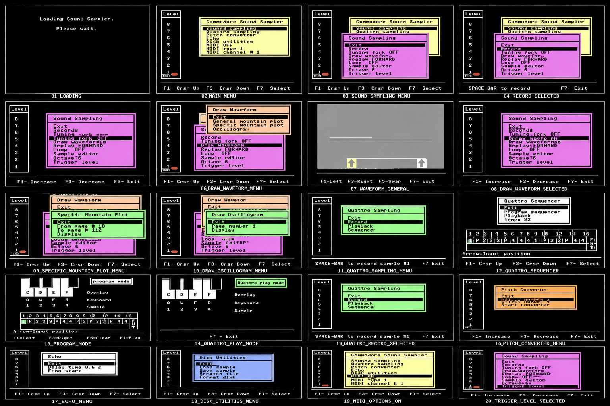

# Project Phoenix Sound Sampler

> **The Return of the Hardware Sampler**

An open embedded hardware sampler designed from the ground up ---
inspired by the legendary Commodore 64 SFX Sound Sampler, reimagined
with modern DSP, SD storage, multitimbrality and a completely new
software architecture.

------------------------------------------------------------------------

# Hero Image

  

**Project Phoenix --- currently under development**

------------------------------------------------------------------------

# Current Development Prototype

  

*Current ESP32-S3 based development prototype used for firmware and
hardware evaluation.*

------------------------------------------------------------------------

# Why Phoenix?

Project Phoenix is not intended to compete with commercial products.

Instead, it documents the complete engineering process behind designing
a modern embedded hardware sampler.

Every architectural decision, firmware milestone, hardware revision and
DSP algorithm will be documented and published openly.

------------------------------------------------------------------------

# Design Goals

  Goal                           Status
  ----------------------------- --------
  ESP32-S3 Platform                ✅
  Open Source Firmware             🚧
  Open Hardware Documentation      🚧
  SD Card Sample Library           🚧
  Smart Sample Analysis            ✅
  Vintage Sampler Engine           ✅
  Multisample Engine               🚧
  Velocity Layers                  🚧
  Round Robin                      🚧
  Smart Loop Engine                🚧
  Touch User Interface             🚧

------------------------------------------------------------------------

# Philosophy

Phoenix follows the principles of the **Realtime Audio Lab (RTAL)**:

-   Open Engineering
-   Educational Value
-   Long-Term Maintainability
-   Transparent Development
-   Knowledge Sharing

------------------------------------------------------------------------

# Current Features

## Sampling

-   Stereo Recording
-   Smart Sample Analysis
-   Auto Trim
-   Auto Normalize
-   Zero Crossing Detection
-   Non-Destructive Editing

## Playback

-   16 Voices
-   ADSR
-   Filters
-   Pitch Bend
-   Vintage DAC Simulation
-   Keygroups
-   Velocity Layers
-   Round Robin

## Storage

-   WAV Import
-   SD Card Browser
-   Sample Banks
-   Configuration Files

------------------------------------------------------------------------

# Development Roadmap

Unit End 2026

- Smart Sampling
- Vintage Engine
- Multisample
- Round Robin
- Keygroups

Status Juli 2026

- Smart Loop Engine
- Touch User Interface
- Phoenix Version 1.0

------------------------------------------------------------------------

# Open Engineering

Unlike many commercial products, Project Phoenix documents the complete
engineering process.

Included in this repository over time:

-   Firmware source code
-   Hardware schematics
-   Mechanical concepts
-   DSP algorithms
-   Audio processing techniques
-   Performance measurements
-   Engineering notes
-   Design decisions

------------------------------------------------------------------------

# Current Development Status

Firmware

██████████░░░░░░░░░░ 45%

Hardware

███████░░░░░░░░░░░░░ 30%

Mechanical Design

████░░░░░░░░░░░░░░░░ 15%

------------------------------------------------------------------------

# Planned Repository Structure

- Project_Phoenix/
- docs/
- firmware/
- hardware/
- mechanics/
- images/
- audio_examples/
- README.md
- CHANGELOG.md
- LICENSE

------------------------------------------------------------------------

# Follow the Journey

Project Phoenix is a long-term engineering project documenting the
evolution of a modern embedded hardware sampler---from the first
prototype to the finished musical instrument.

------------------------------------------------------------------------

  

  
*C64 SFX Menu*

  

  
*C64 SFX ESP32 Version Menu*

