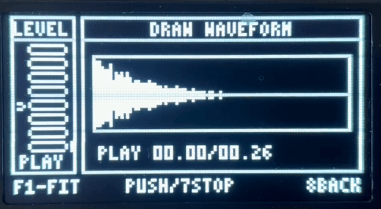
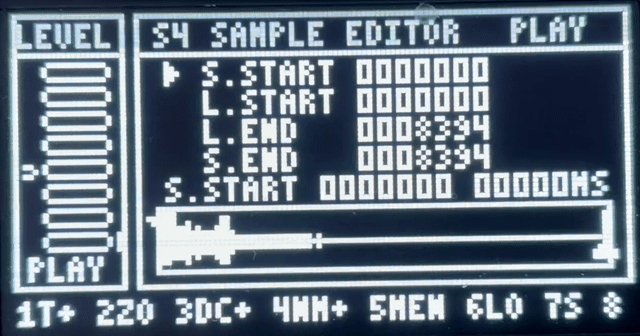
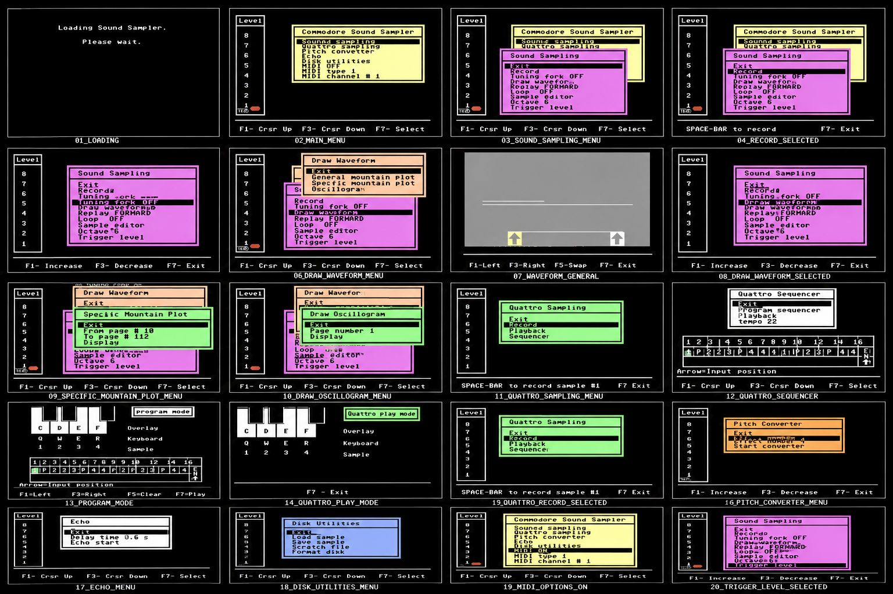

# 🔥 PROJECT PHOENIX

### ESP32-S3 Polyphonic Hardware Sampler  
**4 Sample Slots · 12 Voices · Multisampling · Realtime Sequencer · Sample Editor · MIDI · USB · Phoenix Librarian**

**Version 1.0.0 FINAL**

[](https://www.espressif.com/)
[](https://www.arduino.cc/)
[](#audio-engine)
[](#release-status)

**RealTimeAudioLab / RTAL**

---

> **Phoenix is a standalone ESP32-S3 hardware sampler designed as an instrument — not just a sample player.**  
> Record, import, sculpt, loop, map, sequence and perform samples directly on the hardware, then manage complete banks comfortably on Windows with **Phoenix Librarian**.

</div>

---

## 🎬 Phoenix in action

------------------------------------------------------------------------

## 📸 Hero Image

</p>

<p align="center">
  


*Phoenix 3D printed case.*

------------------------------------------------------------------------

## 📸 Current Development Prototype

</p>

<p align="center">
  


*The current ESP32-S3 based hardware platform used for firmware, DSP and
hardware development.*

------------------------------------------------------------------------
## 📸 Draw Waveform
<p align="center">
  
</p>

------------------------------------------------------------------------
## 📸 Sample Editor
<p align="center">
  
</p>

------------------------------------------------------------------------

# What is Phoenix?

**Project Phoenix** is a complete sample-based musical instrument built around the **ESP32-S3**.

The sampler combines four directly accessible sample slots with a global **12-voice polyphonic playback engine**, onboard recording, waveform editing, loop processing, multisamples, keyzones, MIDI, effects, a four-track pattern sequencer, song chaining, SD-card storage and USB mass-storage access.

Phoenix v1.0.0 FINAL is the first frozen stable release of the platform.

### At a glance

| Feature | Phoenix v1.0.0 |
|---|---|
| MCU | ESP32-S3 @ 240 MHz with PSRAM |
| Polyphony | **12 global sample voices** |
| Audio engine | **32 kHz**, 128-frame blocks |
| Basic sample slots | **4** |
| ADC | PCM1808 |
| DAC | PCM5102A |
| Sample import | WAV → Phoenix 32 kHz mono format |
| Sampling | Direct recording from ADC |
| Loop modes | OFF / FORWARD / ALTERNATE |
| Multisampling | Keygroups, velocity layers, round robin |
| Performance modes | KEYZONE / MULTI |
| Sequencer | 4 patterns × 4 tracks × up to 16 steps |
| MIDI clock | Internal / External, 24 PPQN |
| MIDI transport | FA Start / FC Stop, continuous F8 supported |
| Storage | SD card + USB Mass Storage |
| PC companion | **Phoenix Librarian v1.0.0** |

---

# Highlights

## 🎙 Sampling and waveform editing

Phoenix can record directly from the **PCM1808 ADC** and play back through a **PCM5102A DAC**.

Each sample can be edited directly on the hardware:

- Sample Start
- Loop Start
- Loop End
- Sample End
- Normalize
- DC correction
- Root note
- Pitch tracking
- ADSR
- Loop mode
- Loop crossfade
- Level and panorama

The four marker positions follow a clear playback model:

```text
S.START ---- L.START ================= L.END ---- S.END
               <---- LOOP AREA ---->
```

FORWARD loops restart at `L.START`.  
ALTERNATE loops run as bidirectional ping-pong loops.

---

## 🎹 12-voice polyphonic sample engine

Phoenix uses one global voice pool for all sample slots and multisample regions.

```text
                    ┌─────────────────────┐
MIDI / Sequencer ──►│  12-Voice Allocator │
                    └─────────┬───────────┘
                              │
             ┌────────────────┼────────────────┐
             ▼                ▼                ▼
       Sample Voices      Multisamples      Keyzones
             │                │                │
             └────────────────┼────────────────┘
                              ▼
                       Filter / FX / Mix
                              │
                              ▼
                          PCM5102A
```

The v1.0 voice engine includes ownership protection, sustain handling, duplicate-note handling and guarded voice stealing.

---

## 🧩 Multisampling

Phoenix is not limited to four static WAV files.

The multisample system supports:

- multiple keygroups
- keyboard ranges
- velocity layers
- round robin
- root-note mapping
- one-shot regions
- forward loops
- alternate loops
- per-region sample assignment

This makes Phoenix suitable for much more than drums: pianos, strings, pads, percussion sets, sound effects and experimental sample instruments can all be built from the same engine.

---

## 🎚 Quattro: KEYZONE and MULTI

The four primary sample slots can operate as a single performance setup.

### KEYZONE

Split the keyboard into zones and assign different samples to different ranges.

```text
C1                C3                C5                C7
│------ SLOT 1 -----│
          │------ SLOT 2 ------│
                    │------ SLOT 3 ------│
                              │------ SLOT 4 ------│
```

### MULTI

Several slots can respond simultaneously, each with its own level, panorama, range and processing.

This allows layered instruments, stacked textures and complex live setups.

---

# ⚡ Realtime sequencer

One of the central architectural features of Phoenix v1.0.0 is the dedicated realtime sequencer path.

The final engine no longer lets display, SD-card or normal UI work determine musical timing.

```text
CORE 0
┌────────────────────┐
│ MIDI Task      P10 │
│ F8 / FA / FC       │
└─────────┬──────────┘
          │ timestamped clock
          ▼
┌────────────────────┐
│ SeqRT Task      P8 │
│ 24 PPQN            │
│ step scheduling    │
└─────────┬──────────┘
          │ scheduled events
══════════╪════════════════════════════════════
          ▼
CORE 1
┌────────────────────┐
│ Audio Task      P24│
│ 128-frame blocks   │
│ intra-block events │
└─────────┬──────────┘
          ▼
        AUDIO
```

External MIDI clock is designed for systems where **F8 continues permanently** and transport is controlled separately by **FA Start** and **FC Stop**.

Six MIDI clock ticks correspond to one 16th-note sequencer step.

The v1.0 validation build demonstrated scheduled event placement inside the 128-frame audio block while keeping realtime audio overruns and clock/command drops at zero during the validated tests.

---

# 🥁 Pattern Sequencer

Phoenix includes a four-track hardware step sequencer:

- **4 patterns**
- **4 tracks per pattern**
- **1–16 steps per track**
- note
- velocity
- gate length
- individual track lengths
- internal or external clock
- pattern management
- song chaining

A step contains:

```text
ACTIVE | NOTE | VELOCITY | GATE
```

Different track lengths can be used to create polymetric patterns.

---

# 🎛 Sound processing

Phoenix v1.0 contains a lightweight realtime processing chain designed specifically for the ESP32-S3 audio budget.

### Filter

Sample playback can be shaped using the onboard filter section with realtime cutoff and modulation control.

### Echo

The delay engine includes smoothed parameter handling and click-reduced delay-time transitions.

### Vintage Sampler

Phoenix can deliberately move away from clean modern playback through its Vintage Sampler section, including reduced-rate / reduced-resolution style processing and character parameters.

---

# 💾 Banks and SD storage

Phoenix stores instruments as banks on the SD card.

Typical structure:

```text
/PHOENIX
│
├── CONFIG.TXT
├── WAV/
├── EXPORT/
│
└── BANKS/
    ├── BANK01/
    │   ├── BANK.CFG
    │   ├── BANK.INFO
    │   ├── SLOT1.WAV
    │   ├── SLOT2.WAV
    │   ├── SLOT3.WAV
    │   ├── SLOT4.WAV
    │   ├── MULTISAMPLE.CFG
    │   ├── PATTERNS.CFG
    │   └── SONG.CFG
    │
    ├── BANK02/
    └── ...
```

Current formats:

```text
BANK_VERSION        15
MULTISAMPLE_VERSION 10
```

Phoenix uses transactional bank storage to reduce the risk of destroying an existing bank during a failed save operation.

---

# 🖥 Phoenix Librarian

**Phoenix Librarian v1.0.0** is the Windows companion application for Project Phoenix.

It works directly with the same Phoenix bank structure used by the hardware.

<p align="center">
  
</p>

### Librarian features

- Bank management
- Waveform editor
- Loop editor
- KEYZONE / MULTI editor
- Pattern sequencer
- Song editor
- Echo / FX editing
- Bank metadata
- MIDI monitor
- On-screen keyboard
- Polyphonic PC audio preview
- Factory library
- Search and filters
- Backup & Restore
- Bank validation
- Self Test and diagnostics

### Typical hardware ↔ PC workflow

```text
PHOENIX HARDWARE
      │
      │ USB Mass Storage
      ▼
WINDOWS
      │
      ▼
PHOENIX LIBRARIAN
      │
      ├── Backup bank
      ├── Import / edit samples
      ├── Set loops
      ├── Build keyzones / multis
      ├── Edit patterns and songs
      ├── Preview audio
      └── Validate
      │
      ▼
Save to Phoenix volume
      │
      ▼
Safely eject USB volume
      │
      ▼
Reload bank on Phoenix
```

The Librarian can also work directly with the SD card or with a local copy of the complete Phoenix file structure.

> Phoenix Librarian complements the hardware.  
> **Phoenix plays the instrument — Librarian organizes, edits, previews and validates its data.**

---

# 🔌 Hardware

## Audio

```text
ESP32-S3                    PCM1808 ADC
────────                    ───────────
GPIO0   MCLK  ─────────────► MCLK / SCKI
GPIO18  BCLK  ─────────────► BCK
GPIO16  LRCK  ─────────────► LRCK / WS
GPIO5   DIN   ◄───────────── DOUT


ESP32-S3                    PCM5102A DAC
────────                    ────────────
GPIO18  BCLK  ─────────────► BCK
GPIO16  LRCK  ─────────────► LCK / LRCK
GPIO17  DOUT  ─────────────► DIN
```

The PCM1808 and PCM5102A share BCLK and LRCK/WS.  
The ADC master clock is supplied from **GPIO0**.

---

## Complete ESP32-S3 pinout

| Function | GPIO |
|---|---:|
| PCM1808 MCLK / SCKI | **0** |
| I2S BCLK | **18** |
| I2S LRCK / WS | **16** |
| I2S DOUT → PCM5102A | **17** |
| I2S DIN ← PCM1808 | **5** |
| OLED SCK | **12** |
| OLED MOSI | **11** |
| OLED CS | **10** |
| OLED DC | **6** |
| OLED RESET | **7** |
| SD SCK | **12** |
| SD MOSI | **11** |
| SD MISO | **13** |
| SD CS | **9** |
| MIDI RX | **40** |
| MIDI TX | **39** |
| F1 | **21** |
| F2 | **47** |
| F3 | **45** |
| F4 | **38** |
| F5 | **4** |
| F6 | **15** |
| F7 | **3** |
| F8 | **14** |
| Encoder A | **1** |
| Encoder B | **2** |
| Encoder Switch | **42** |
| Native USB D− | **19** |
| Native USB D+ | **20** |

OLED and SD share SPI `SCK GPIO12` and `MOSI GPIO11`, while using independent chip-select signals.

All GPIO signals are **3.3 V logic**.

---

# 🧠 Task architecture

Phoenix deliberately separates realtime audio from MIDI, sequencing and user-interface work.

```text
ESP32-S3 @ 240 MHz

CORE 1
└── AudioTask      Priority 24
    ├── I2S input
    ├── voice rendering
    ├── sample-accurate scheduled events
    ├── filter / effects
    └── I2S output

CORE 0
├── MidiTask       Priority 10
├── SeqRT          Priority 8
└── ControlTask    Priority 3
    ├── UI
    ├── encoder / buttons
    ├── SD / bank management
    └── system control
```

Audio block:

```text
Sample rate : 32,000 Hz
Block size  : 128 frames
Deadline    : 4.0 ms
Voices      : 12
```

---

# 🎹 MIDI

Phoenix supports standard DIN MIDI through the ESP32-S3 hardware serial interface.

```text
MIDI IN  → GPIO40
MIDI OUT → GPIO39
Baud     → 31250
```

The MIDI system supports, among other functions:

- Note On / Note Off
- Velocity
- Sustain pedal
- Pitch Bend
- Control Change
- MIDI Learn
- external MIDI clock
- Start / Stop transport

For external-clock operation:

```text
F8 = MIDI CLOCK (24 PPQN)
FA = START
FC = STOP
```

Continuous F8 while stopped is explicitly supported.

---

# 🕹 Controls

Phoenix uses eight front-panel buttons and one rotary encoder with push switch.

```text
F1  GPIO21
F2  GPIO47
F3  GPIO45
F4  GPIO38
F5  GPIO4
F6  GPIO15
F7  GPIO3
F8  GPIO14

Encoder A   GPIO1
Encoder B   GPIO2
Encoder SW  GPIO42
```

The switches are active-low and are normally wired from GPIO to GND using the ESP32-S3 internal pull-ups.

---

# 🧰 Development environment

The v1.0 FINAL firmware was developed for:

```text
Arduino IDE          1.8.19
Arduino-ESP32 Core   2.0.16
MCU                  ESP32-S3
CPU                  240 MHz
PSRAM                8 MB
Flash                16 MB
Audio                32 kHz / 128 frames
```

The realtime audio translation unit uses targeted optimization while avoiding global fast-math behavior.

---

# 🚀 Quick start

1. Build the Phoenix hardware according to the pinout above.
2. Install the required Arduino libraries.
3. Open the Phoenix v1.0.0 FINAL sketch in Arduino IDE 1.8.19.
4. Select the correct ESP32-S3 board configuration.
5. Compile and upload.
6. Insert a prepared Phoenix SD card.
7. Connect audio input/output.
8. Connect MIDI.
9. Power up Phoenix.
10. Load a bank and play.

For detailed operation, see the **Phoenix v1.0.0 Bedienungshandbuch** in the repository documentation.

---

# 🧪 Service mode & diagnostics

Hold the encoder switch while powering on Phoenix to enter the service/self-test area.

Available tests include:

- Audio Output Test
- Audio Input Test
- Button Test
- System Diagnostics
- Start Sampler

Runtime diagnostics expose audio, MIDI, sequencer and storage health counters, making realtime problems measurable instead of relying only on subjective testing.

---

# ✅ Release status

## Phoenix v1.0.0 FINAL

The first stable Phoenix release was frozen after the v0.9.0 RC1 regression and endurance phase.

The validated release architecture includes:

- 12-voice realtime sample engine
- guarded MIDI / voice ownership
- transactional bank storage
- sample and loop boundary hardening
- robust MIDI Start / Stop handling
- continuous external F8 clock support
- dedicated realtime sequencer task
- intra-block event scheduling
- cooperative SD / bank I/O
- multisample validation
- stabilized delay-time changes
- USB Mass Storage workflow
- Phoenix Librarian integration

The v1.0 release is intended to remain frozen. Future development should branch from this release rather than modify the archived FINAL source.

---

# 📖 Documentation

Recommended repository structure:

```text
docs/
├── Phoenix_v1_0_0_Bedienungshandbuch_DE.pdf
├── Phoenix_Librarian_v1_0_0_Bedienungsanleitung_DE.pdf
├── Phoenix_Librarian_v1_0_0_Quick_Start_DE.pdf
├── Phoenix_Librarian_v1_0_0_Dateiformat_Referenz_DE.pdf
└── images/
    ├── phoenix-hero.jpg
    ├── phoenix-waveform.gif
    ├── phoenix-sample-editor.gif
    └── phoenix-librarian.png
```

---

# 🔥 Why Phoenix?

Phoenix started as a sampler experiment and grew into a complete embedded musical instrument.

The project explores how far an ESP32-S3 can be pushed when audio processing, MIDI, sequencing, storage and UI are treated as one coherent realtime system.

It is built around a simple idea:

> **Samples should not just be played back. They should become instruments.**

---

<div align="center">

## PROJECT PHOENIX

**Sample · Sculpt · Map · Sequence · Perform**

ESP32-S3 Hardware Sampler  
Phoenix v1.0.0 FINAL

**RealTimeAudioLab / RTAL**

</div>


# Project Phoenix Sound Sampler

# 🎹 The Return of the Hardware Sampler

### *An Open Engineering Project by Realtime Audio Lab (RTAL)*

*Inspired by the legendary Commodore 64 SFX Sound Sampler --- redesigned
for the modern embedded world.*

------------------------------------------------------------------------

> **Project Phoenix is not simply another sampler.**
>
> It is the complete documentation of designing, engineering and
> building a professional embedded musical instrument from scratch.

------------------------------------------------------------------------

# 📸 Hero Image

</p>

<p align="center">
  


*A vision of the final instrument.*

------------------------------------------------------------------------

# 📸 Current Development Prototype

</p>

<p align="center">
  


*The current ESP32-S3 based hardware platform used for firmware, DSP and
hardware development.*

------------------------------------------------------------------------
## 📸 Draw Waveform
<p align="center">
  
</p>

------------------------------------------------------------------------
## 📸 Sample Editor
<p align="center">
  
</p>

------------------------------------------------------------------------

# Why Project Phoenix?

Modern hardware samplers are often closed systems.

Phoenix follows another philosophy:

-   Open Hardware
-   Open Firmware
-   Open Engineering
-   Open Documentation

Every important engineering decision will be documented.

Visitors are invited to follow the complete journey from the very first
prototype to Version 1.0.

------------------------------------------------------------------------

# Engineering Philosophy

Project Phoenix is built around five principles:

-   Engineering before marketing
-   Simplicity where possible
-   Professional audio quality
-   Educational value
-   Long-term maintainability

------------------------------------------------------------------------

# Current Development Status

| Module                  | Status |
|-------------------------|:------:|
| Audio Engine            | ✅ |
| Smart Sample Analysis   | ✅ |
| Vintage Sampler Engine  | ✅ |
| SD Card Browser         | ✅ |
| Multisamples            | ✅ |
| Velocity Layers         | ✅ |
| Round Robin             | ✅ |
| Smart Loop Engine       | ✅ |
| Complete Hardware       | ✅ |

------------------------------------------------------------------------

# Planned Hardware

-   ESP32-S3
-   PCM1808 Audio ADC
-   PCM5102 DAC
-   SD Card
-   MIDI In / Out
-   OLED Display
-   8 Buttons

------------------------------------------------------------------------

# Software Architecture

``` text
             MIDI
               │
               ▼
        User Interface
               │
               ▼
        Sample Manager
               │
     ┌─────────┴─────────┐
     ▼                   ▼
 Smart Analysis     Audio Engine
     ▼                   ▼
 Vintage DSP       Effects Engine
     └─────────┬─────────┘
               ▼
           PCM5102 DAC
```

------------------------------------------------------------------------

# Major Features

## Sampling

-   Smart Sample Analysis
-   Automatic Trim
-   Automatic Normalize
-   Zero Crossing Detection
-   Non-destructive Editing

## Playback

-   Polyphonic Playback
-   Keygroups
-   Velocity Layers
-   Round Robin
-   ADSR
-   Filters
-   Pitch Bend
-   Vintage DAC Simulation

## Storage

-   WAV Import
-   SD Card Browser
-   Sample Banks
-   Configuration Files

------------------------------------------------------------------------

# Development Roadmap

``` text
v0.1   Prototype
v0.3   Audio Engine
v0.5   Sample Browser
v0.7   Smart Sampling
v0.8   Smart Loop Engine
v0.9   Endurance-/Regressionstest
v1.0   First Public Release
```

------------------------------------------------------------------------

# Open Engineering

Unlike commercial products, Phoenix documents:

-   firmware evolution
-   hardware revisions
-   DSP algorithms
-   performance measurements
-   design decisions
-   engineering notes
-   experiments
-   failures and improvements

Everything is part of the engineering story.

------------------------------------------------------------------------

# Repository Structure

``` text
Project_Phoenix/

firmware/
schematic/
doc/
images/
audio_examples/

README.md
CHANGELOG.md
LICENSE
```

------------------------------------------------------------------------

# Follow the Journey

Project Phoenix is intended to become one of the most comprehensively
documented open embedded sampler projects available.

Whether you are interested in:

-   Embedded Systems
-   Audio DSP
-   MIDI
-   Firmware Architecture
-   Hardware Design
-   Digital Audio

...you are welcome to follow the development.

------------------------------------------------------------------------

# About RTAL

## Realtime Audio Lab

**Engineering Heritage Archive**

Sharing over four decades of experience in:

-   Embedded Audio Systems
-   Digital Musical Instruments
-   Hi-Fi Engineering
-   Vintage Hardware Restoration
-   Open Engineering Documentation

------------------------------------------------------------------------

⭐ **If you enjoy following long-term engineering projects, consider
starring this repository.**


------------------------------------------------------------------------

<p align="center">
  

  
*C64 SFX Menu*
</p>

<p align="center">
  

  
*C64 SFX ESP32 Version Menu*

